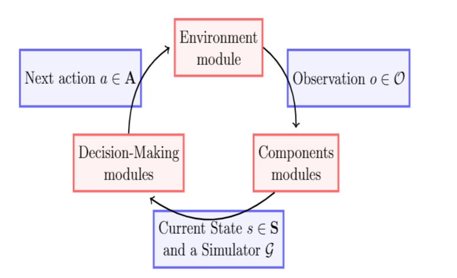
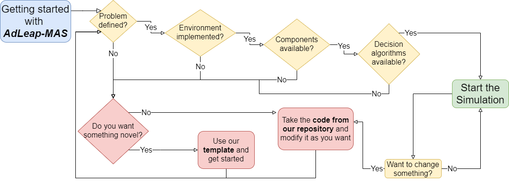

# AdLeap-MAS: An Open-source Multi-Agent Simulator for Ad-hoc Learning and Planning

## Introduction

<p style="text-align: justify; text-indent: 20px;" >
<i>AdLeap-MAS</i> represents a novel framework focused on the implementation and simulation of Ad-hoc reasoning domains, which considers the approach of collaborative and adversarial contexts focused on ad-hoc environment learning and planning. The framework aims to facilitate the running of experiments in the domain and also re-use existing codes across different environments. In other words, this proposal aims to minimise the implementation cost related to the process that precedes the domain evaluation, which could include the environment design, components settings and, benchmark set definition, while simultaneously improving the robustness of the environment and minimising the errors carried out due to mistakes made in the code adaptation or implementation. Through the definition of a component-based architecture, <i>AdLeap-MAS</i> implements <i>Open-AI Gym package</i> for <i>Python 3</i> as the primary tool to define its base components. Designed to be an open-source framework and a specialised version of the Open-AI Gym simulator, we offer the base classes for implementing new contexts and scenarios of the community's interest.
</p>

## Summary

In this README you can find:

* [GET STARTED](#sec-getstarted)
    * [1. Dependencies](#sec-dependencies)
    * [2. Usage](#sec-usage)
    * [3. How to change the components within the framework?](#sec-components)
* [EXAMPLES](#sec-examples)
    * [1. Level-Foraging Environment](#sec-levelforaging)
    * [2. Truco Environment](#sec-truco)
* [DEVELOPMENT INFORMATION](#sec-development)
* [REFERENCES](#sec-references)

<a name="sec-getstarted"></a>
## GET STARTED

<a name="sec-dependencies"></a>
### 1. Dependencies :pencil: 
 
<p style="text-align: justify; text-indent: 20px;" >  
You must install Python 3 and the OpenAI Gym package to run the framework.
You can use <a href="https://www.python.org/downloads/">Python 3 website</a> and the <a href="https://github.com/openai/gym">OpenAI Gym GitHub</a> for information about installation **or**, if you are programming at Linux, run the following command lines:
</p>

> **For Python 3:**
>
> `sudo apt-get install software-properties-common & sudo add-apt-repository ppa:deadsnakes/ppa & sudo apt-get update & sudo apt-get install python3.8`

> **For OpenAI Gym (Minimal Install):**
>
> `pip install gym`

> **For OpenAI Gym (Full Install):**
>
> `apt-get install -y libglu1-mesa-dev libgl1-mesa-dev libosmesa6-dev xvfb ffmpeg curl patchelf libglfw3 libglfw3-dev cmake zlib1g zlib1g-dev swig`

**NOTE:** make sure that the [NumPy package](https://numpy.org/install/) is also installed for Python 3 before running the framework.

> `pip install numpy` **OR** `pip3 install numpy`

### Windows

<p style="text-align: justify; text-indent: 20px;" >  
To execute this framework on Windows OS, you will need to work within the <a href="https://docs.microsoft.com/en-us/windows/wsl/install-win10">Windows Subsystem for Linux</a>.
We recommend installing <i>Ubuntu 16.04</i> and <i>Ubuntu 18.04</i> as your Linux distribution into the Windows Subsystem.
Moreover, you must install the <a href="https://sourceforge.net/projects/vcxsrv/">VcXserver Windows X Server</a> to compile the framework correctly.
The VcXserver will enable the simulated environment visualisation, creating the correct display to run your tests.
</p>

<p style="text-align: justify; text-indent: 20px;" >  
Once you started your VcXserver (before running the framework), select the following options on the start screen:
</p>

<table border="0" cellspacing="0" cellpadding="0" border-collapse="collapse">
 <tr border="0" cellspacing="0" cellpadding="0" border-collapse="collapse">
    <td></td>
    <td></td>
 </tr>
 <tr border="0" cellspacing="0" cellpadding="0" border-collapse="collapse">
    <td colspan="2" align="center"></td>
 </tr>
</table>

**NOTE:** If your program still cannot access the virtual screen or the error *NoSuchDisplay* arises, the following line may fix the problem:

> `export DISPLAY=$(cat /etc/resolv.conf | grep nameserver | awk '{print $2}'):0`

------------------------
<a name="sec-usage"></a>
### 2. Usage :muscle:

<p style="text-align: justify; text-indent: 20px;" >  
With all dependencies installed, you have to download this GitHub project and set it on your local workspace.
To start the framework, you only need to choose an environment and run the file <i><b>test_[environment_name].py</b></i>.
Via the command line, you can use (within the main project directory):
<p>

> `python3 test_[environment_name].py`

<p style="text-align: justify; text-indent: 20px;" >  
That's all folks. At this point, you will have the display popping up and the simulation starting with the default components.
<p>

**NOTE:** If you want to run/implement different environments, you can create new main files using the same routine presented for the Level-Foraging or Truco Environments execution, which can be easily specified by the following routine:

```python
    """Generic AdLeap-MAS execution routine"""

    env = AdhocReasoningEnv(args)
    state = env.reset()
    
    while not done and env.episode < max_episode:
        env.render()

        next_action, _ = type_planning(state,agent)

        state, reward, done, info = env.step(next_action)

        if done:
            break

    env.close()
```

### Understanding (High level view)

<p style="text-align: justify; text-indent: 20px;" >
The <i>AdLeap-MAS</i> framework’s architecture is based on unilateral and cyclical module communication, where the information within the framework must be delivered  or  received  directly  and  exclusively  by  one  module  from  another  in the architecture.  Such design enables the problem simulation as a step-by-step process, processing each fragment of the simulation (i.e., functionalities) independently.  As in a cascade workflow definition, this specific approach guarantees the correct information analysis and transformation in each step. Furthermore, it  is  important  to  note  that  each  module  acts  independently  from  the  other components. As such, learning and reasoning are based solely on the delivered information. The following figure presents this idea at a high level.
</p>



<p style="text-align: justify; text-indent: 20px;" >
From this perspective, we designed each component to achieve the final purpose. Consequently, we describe the desired final products for each component.
</p>

<p style="text-align: justify; text-indent: 20px;" >
Perhaps, the arising question now is: how did we separate the environment from its components and the components from their learning and reasoning modules? The answer is direct: we do not. However, considering that each module works strictly over the current information, it is reasonable to assume that this data can provide sufficient knowledge to simulate the environment without building a bilateral communication channel. This feature can facilitate the modification in the environment without affecting other functionalities already implemented and tested.
</p>

<p style="text-align: justify; text-indent: 20px;" >
As an user, you must answer the following question to get started:
</p>



<p style="text-align: justify; text-indent: 20px;" >
For further explanation, we suggest the reading of our paper available at: <i><b>to appear</b></i>
</p>

------------------------
<a name="sec-components"></a>
### 3. How to change the components within the framework? :fearful:

<p style="text-align: justify; text-indent: 20px;" >
Changing components of the environment is REALLY not troublesome. The idea is simple: you must have the code that implements your desired element (which can refer to the agents, tasks or even the reasoning module) and add it to the environment's components dictionary. Presenting it clearer, the following code shows the base structure to plug-in components to your experiment:
</p>

```python
    """Generic AdLeap-MAS environment's components definition"""
    from your_agent_implementation_module import Agent
    from your_task_implementation_module import Task
    from your_environment_implementation_module import Environment

    components = {
    'agents':[
        Agent(index='A',atype='reasoning_1'),
        Agent(index='B',atype='reasoning_2'),
        Agent(index='C',atype='reasoning_3'),
        Agent(index='D',atype='reasoning_4')
    ],
    'tasks':[Task('1',(2,2),1.0),
            Task('2',(4,4),1.0),
            Task('3',(5,5),1.0),
            Task('4',(8,8),1.0)]}

    env = Environment(components)
```

<p style="text-align: justify; text-indent: 20px;" >
That is it! At this point, your environment already implements the desired components within the case of study.
</p>

<p style="text-align: justify; text-indent: 20px;" >
Regarding the reasoning modules, they do not need a proper importation because our framework implements a generic method to call the reasoning.
In this way, your reasoning module just needs to have the following structure to run within the architecture:
</p>

```python
    """Generic AdLeap-MAS reasoning modules implementation"""
    """- Example file name: mymethod.py"""

    def mymethod_planning(environment, adhoc_agent, ...):

        """ code here """

        return action, _
```

<p style="text-align: justify; text-indent: 20px;" >
Again: that is all folks! At this point, your reasoning method already can be used within our framework for every case of study.
</p>

<p style="text-align: justify; text-indent: 20px;" >
For further explanation, we suggest the reading of our paper available at: <i><b>to appear</b></i>
</p>

------------------------
<a name="sec-examples"></a>
## EXAMPLES

<a name="sec-levelforaging"></a>
### [1. Level-Foraging Environment](https://github.com/lsmcolab/adleap-mas/tree/master/src/envs)

<p style="text-align: justify; text-indent: 20px;" >
Initially introduced to evaluate ad hoc teamwork, the Level-based Foraging domain <a href="#albrecht2015game">[1,</a> <a href="#stone2010adhoc">2]</a> represents a problem in which a team of agents must collaborate to accomplish a certain number of tasks in an environment, optimising the time spent in the activity via active collaboration-coordination.
The agents have a certain level (strength) that defines if it is able to collect an item (e.g., a box) of a specific weight.
The boxes are distributed in the environment, and the agents cannot communicate with their teammates.
The following figure illustrates the idea of the problem.
</p>


<p style="text-align: justify; text-indent: 20px;" >
As presented, the <i>AdLeap-MAS</i> can implement this problem, while enabling the simulation of <b>(i)</b> a real-time decision (instead of a turn-based approach) and <b>(ii)</b> an online learning and planning of the problem.
The environment implementation delivers only the visible information to the agents, deferring to them the responsibility to reason about the missing data and build the corresponding belief state.
Additionally, in this domain, the agents have four parameters: level, vision radius, vision angle and type; and the tasks have only one parameter: weight.
The initial position and these parameters are all concealed from the agents.
</p>


<a name="sec-truco"></a>
### [2. Truco Environment](https://github.com/lsmcolab/adleap-mas/tree/master/src/envs)

<p style="text-align: justify; text-indent: 20px;" >
A popular card game in Brazil, Truco is played by pairs of people, compounding two teams.
The game starts with dealing three cards for each player and turning up one card on the table.
Each card has a strength associated with its rank and suit, which will compare the cards, one against the other. 
The team's goal is to score 12 points over a maximum of 23 rounds, playing over a best-of-three game system.
The team scores 1 point if they win the best-of-three round.
The following figure illustrates Truco's table for four players playing the game.
</p>


<p style="text-align: justify; text-indent: 20px;" >
Categorising a completely distinct environment from the Level-based Foraging domain, the implementation of this card game has a principal objective to show the versatility offered by the AdLeap-MAS.
Furthermore, the implementation enables the simulation of (i) a turn-based approach for the decision-making process and (ii) an online learning of the problem by receiving partial information mainly via the observation of the adversaries' and teammate's play.
Additionally, the environment delivers to the agents only the visible information, allowing them to reason about the missing data and build their belief state.
Note that even though all the hands are visible in the interface, it is not related to the actual information.
</p>


------------------------
<a name="sec-development"></a>
## DEVELOPMENT INFORMATION
**Status:** In development. :computer:

*More information will be documented and presented soon.*

------------------------
<a name="sec-references"></a>
## REFERENCES

<a name="albrecht2015game">[1]</a> Stefano V Albrecht and Subramanian Ramamoorthy. 2015.  A game-theoretic model and best-response learning method for ad hoc coordination in multi agent systems. *arXiv preprint arXiv:1506.01170* (2015).

<a name="stone2010adhoc">[2]</a> Peter Stone, Gal A. Kaminka, Sarit Kraus, and Jeffrey S. Rosenschein. 2010. AdHoc Autonomous Agent Teams: Collaboration without Pre-Coordination. *In Proceedings of the Twenty-Fourth Conference on Artificial Intelligence (AAAI)*.
